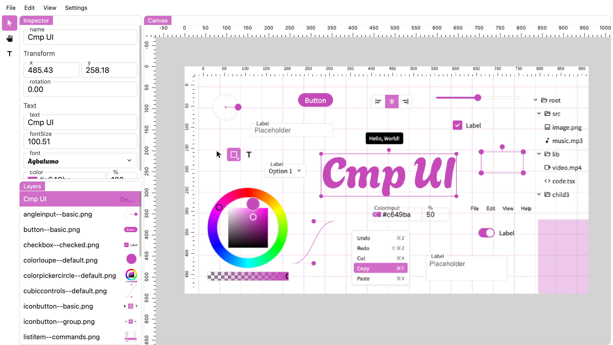

# Yeti

[Demo](https://toshusai.github.io/yeti)

A image editor for the web.

This is a demo project for [CmpUI](https://github.com/toshusai/cmpui) that is a UI library for web applications.

## Basic Features

- Load image from file
- Save image to file
- Undo/Redo
- Move/Resize/Rotate
- Text
- Multiple layers

## Notice

- Only tested on Chrome
- Only supports Desktop
